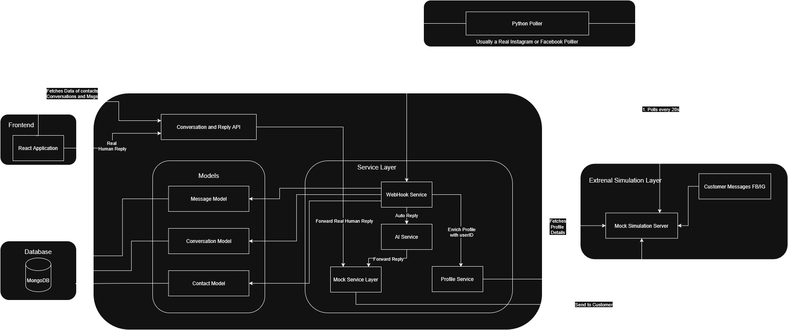

# System Architecture

## Data Flow    

1. Poller fetches new messages from Instagram/Facebook simulation.
2. Backend receives the message via Webhook Service.
3. System ensures contact and conversation exist, then persists the message.
4. AI Service generates an auto-reply.
5. Reply is forwarded to the channel adapter and sent back to customer.
